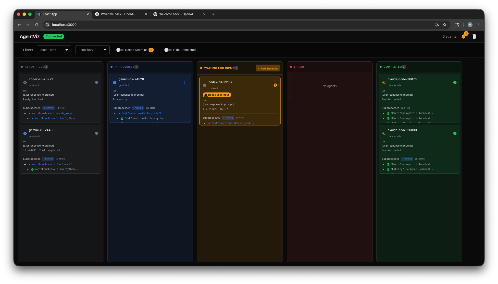
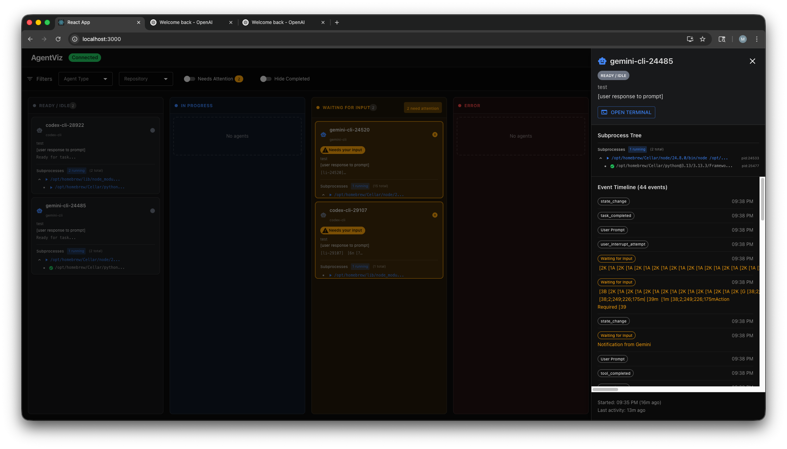
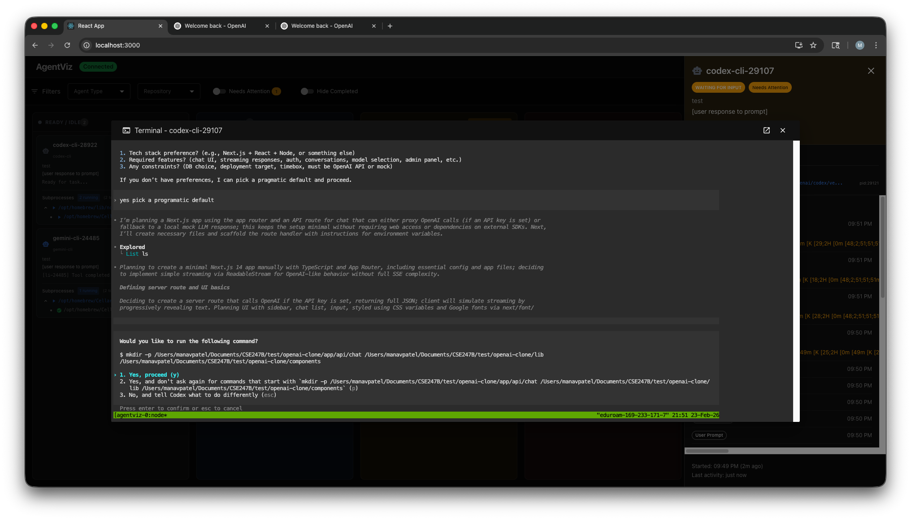

# AgentViz

AgentViz is a local dashboard + event pipeline for visualizing coding agents (Gemini CLI, Claude Code, Codex CLI, etc.) while they run in a workspace.






## Quick Install (one command)

```bash
curl -LsSf https://raw.githubusercontent.com/mpatel17-ucsc/CSE247B_VisualizationCodingAgents/main/scripts/install.sh | sh -s -- ~/agentviz
```

This single command:
- Installs `uv` if not already present
- Clones the repo to `~/agentviz` (or any directory you pass)
- Creates a project-local Python venv and installs all dependencies
- Installs `npm` frontend dependencies if `node` is on PATH
- Places the `agentviz` binary in `~/agentviz/bin/`

Then add the bin directory to your PATH (printed by the installer):

```bash
export PATH="$HOME/agentviz/bin:$PATH"   # add to ~/.zshrc or ~/.bashrc
```

Verify:

```bash
agentviz --help
```

> **Note:** `tmux` and `ttyd` are system tools the installer does not manage — install them separately (`brew install tmux ttyd` on macOS) if you plan to use `--tmux-start`.

---

It includes:

- A Python backend (`FastAPI` + `Socket.IO`) on port `8787`
- A React frontend dashboard (default `npm start` port `3000`)
- Agent adapters for Gemini / Claude / Codex
- Optional `tmux` + `ttyd` mode for interactive web terminals per agent
- Remote viewing support over Tailscale/LAN

## Features

- Live agent state tracking (`ready`, `in_progress`, `waiting_for_input`, `completed`, `error`)
- Hooks-based integration for Gemini CLI and Claude Code
- Codex CLI notify-hook integration (via temporary `CODEX_HOME`)
- File activity / subprocess monitoring
- `tmux` + `ttyd` web terminal access for each agent session
- Remote dashboard + web terminal access (Tailscale/LAN)

## Manual Setup (alternative to Quick Install)

### System tools

- `python` 3.10+
- `node` + `npm` (for the frontend)
- `tmux` (required for `--tmux-start`)
- `ttyd` (required for `--tmux-start`)
- `git`

macOS (Homebrew) example:

```bash
brew install tmux ttyd
```

### Coding agent CLIs (install + authenticate separately)

Install the agent CLI(s) you want to monitor and make sure they run from your shell (or use an absolute path in the command).

- Gemini CLI (`gemini` or your local binary path)
- Claude Code (`claude`)
- Codex CLI (`codex`)

AgentViz does not install these CLIs for you.

## Python Setup (Backend + AgentViz CLI)

**Preferred — using `uv` (fastest, reproducible):**

```bash
uv sync          # creates .venv, installs all deps + agentviz CLI
```

**Alternative — using pip:**

```bash
python3 -m venv venv
source venv/bin/activate
pip install --upgrade pip
pip install -r requirements.txt
pip install -e .
```

## Frontend Setup

Install frontend dependencies once:

```bash
npm install --prefix frontend
```

## Dependency Notes (`requirements.txt` vs local `venv`)

The project's local `venv` package set includes the core runtime dependencies and telemetry-related packages used by the adapters.

Verified against the local `venv` package install:

- Core runtime packages are present in your venv (`fastapi`, `uvicorn`, `pydantic`, `python-socketio`, `psutil`, `watchdog`, `toml`, `requests`)
- Your venv also includes `opentelemetry-proto`, which the Gemini/Claude/Codex adapters use for richer OTEL telemetry parsing

`requirements.txt` has been updated to include:

- `opentelemetry-proto` (for adapter telemetry support)
- `uvicorn[standard]` (instead of plain `uvicorn`) for a more complete backend runtime

## Agent CLI Setup (Gemini / Claude / Codex)

### Important: manual hook/OTEL config is usually NOT required

AgentViz already manages agent-specific hook configuration when you run `agentviz run`:

- Gemini: writes/merges `.gemini/settings.json` in the target workspace, enables hooks, and restores it on cleanup
- Claude Code: writes/merges `.claude/settings.local.json` in the target workspace and restores it on cleanup
- Codex CLI: creates a temporary `CODEX_HOME` with a generated `config.toml` notify hook (no permanent global config changes required)

### OpenTelemetry collector setup (your question)

You generally do **not** need to run a separate OTEL collector manually for AgentViz.

AgentViz adapters start a local OTLP receiver automatically (when telemetry dependencies are installed) and set the needed environment variables for the agent process.

### What you still must do

- Install each CLI
- Authenticate each CLI (vendor login/auth flow)
- Ensure the executable is on `PATH` or use an absolute path

Examples:

- `gemini` or `/opt/homebrew/bin/gemini`
- `claude`
- `codex`

## CLI Commands and Flags

### `agentviz server`

Starts the backend server (Socket.IO + API) on port `8787`.

```bash
agentviz server [--bind <ip>] [--remote]
```

Flags:

- `--bind <ip>`: Bind backend to a specific address (default `127.0.0.1`)
- `--remote`: Convenience flag that binds backend to `0.0.0.0` for Tailscale/LAN access

Notes:

- Use `--remote` when viewing from another device (phone/tablet/laptop)
- Backend is always on port `8787`

### `agentviz run`

Runs and monitors one coding agent process.

```bash
agentviz run -w <workspace> [options] <agent-type> <agent-command> [args...]
```

Required:

- `-w <workspace>`: Workspace directory the agent will run in
- `<agent-type>`: Logical adapter name (examples below)
- `<agent-command> [args...]`: Actual command to launch the agent

Options:

- `-i, --id <agent-id>`: Custom AgentViz ID (default is `<agent-type>-<pid>`)
- `--tmux-start`: Run the agent in a `tmux` session and expose a `ttyd` web terminal
- `--remote <hostname-or-ip>`: Hostname/IP used in generated remote `ttyd` URLs (also makes `ttyd` listen on `0.0.0.0`)

Agent type aliases supported:

- Gemini: `gemini`, `gemini-cli`
- Claude: `claude`, `claude-code`
- Codex: `codex`, `codex-cli`, `openai-codex`
- Synthetic test adapter: `synthetic`

### `--remote` on `server` vs `run` (important)

- `agentviz server --remote` exposes the **backend** (`8787`) to other devices
- `agentviz run --remote <host-or-ip>` exposes each agent's **ttyd web terminal** and tells AgentViz what host/IP to embed in the terminal URL

They are different flags with different meanings.

## Standard Run Workflow (3 terminals)

Use placeholders, not absolute paths from your machine:

- `<PROJECT_ROOT>` = this repository root
- `<WORKSPACE>` = the repo/folder the coding agent should work inside
- `<TAILSCALE_IP_OR_HOSTNAME>` = your laptop's Tailscale IP or hostname

### Terminal 1: Backend

```bash
cd <PROJECT_ROOT>
source venv/bin/activate
agentviz server --remote
```

### Terminal 2: Frontend

```bash
cd <PROJECT_ROOT>
HOST=0.0.0.0 npm start --prefix frontend
```

Why `HOST=0.0.0.0`:

- It exposes the React dev server on your laptop so your phone can open it over Tailscale/LAN

### Terminal 3: Agent (examples)

Gemini:

```bash
cd <PROJECT_ROOT>
source venv/bin/activate
agentviz run -w <WORKSPACE> --tmux-start --remote <TAILSCALE_IP_OR_HOSTNAME> gemini-cli /path/to/gemini
```

Claude Code:

```bash
cd <PROJECT_ROOT>
source venv/bin/activate
agentviz run -w <WORKSPACE> --tmux-start --remote <TAILSCALE_IP_OR_HOSTNAME> claude-code claude
```

Codex CLI:

```bash
cd <PROJECT_ROOT>
source venv/bin/activate
agentviz run -w <WORKSPACE> --tmux-start --remote <TAILSCALE_IP_OR_HOSTNAME> codex-cli codex
```

If the agent executable is already on `PATH`, you can use the command name directly. If not, use the full path (as in your Gemini example).

## Tailscale Setup (Phone Access)

This is the standard way to access AgentViz from your phone.

### On your laptop (running AgentViz)

1. Install and sign in to Tailscale.
2. Ensure Tailscale is connected.
3. Get your Tailscale IPv4 address (example command):

```bash
tailscale ip -4
```

Use that IP (or your Tailscale hostname) as `<TAILSCALE_IP_OR_HOSTNAME>`.

### On your phone

1. Install Tailscale and sign into the same tailnet.
2. Confirm the phone is connected to Tailscale.
3. Open the frontend in Safari/Chrome:

```text
http://<TAILSCALE_IP_OR_HOSTNAME>:3000
```

Example (from your setup):

```text
http://100.x.x.x:3000
```

Notes:

- `:3000` is the React frontend dev server
- The frontend connects to backend port `8787` automatically using the same host shown in the browser URL
- Per-agent `ttyd` terminals use dynamically assigned ports (AgentViz publishes those links in the dashboard)

## Common Examples

Gemini with absolute binary path:

```bash
agentviz run -w <WORKSPACE> --tmux-start --remote <TAILSCALE_IP_OR_HOSTNAME> gemini-cli /opt/homebrew/bin/gemini
```

Claude Code:

```bash
agentviz run -w <WORKSPACE> --tmux-start --remote <TAILSCALE_IP_OR_HOSTNAME> claude-code claude
```

Codex CLI:

```bash
agentviz run -w <WORKSPACE> --tmux-start --remote <TAILSCALE_IP_OR_HOSTNAME> codex-cli codex
```

## Troubleshooting

- `Error: Could not connect to AgentViz server at http://localhost:8787`
  - Start `agentviz server` first (same machine as `agentviz run`)

- `tmux not found` / `ttyd not found`
  - Install both system tools (`brew install tmux ttyd`)
  - `--tmux-start` requires both

- Phone can open frontend but dashboard shows disconnected
  - Make sure backend was started with `agentviz server --remote`
  - Confirm port `8787` is reachable on your Tailscale IP

- Phone cannot open `http://<ip>:3000`
  - Make sure frontend was started with `HOST=0.0.0.0 npm start --prefix frontend`
  - Confirm laptop and phone are on the same Tailscale tailnet

- Concern about agent settings files being modified
  - AgentViz writes temporary hook config into the workspace (`.gemini/settings.json` or `.claude/settings.local.json`) and restores/removes it during cleanup
  - Codex uses a temporary `CODEX_HOME` instead of changing your global config

## Notes

- `agentviz run` connects to the backend at `http://localhost:8787`, so the backend must run on the same machine as the monitored agent process.
- For remote use, you are remotely viewing the dashboard/ttyd terminals; the actual agent process still runs on the laptop.
