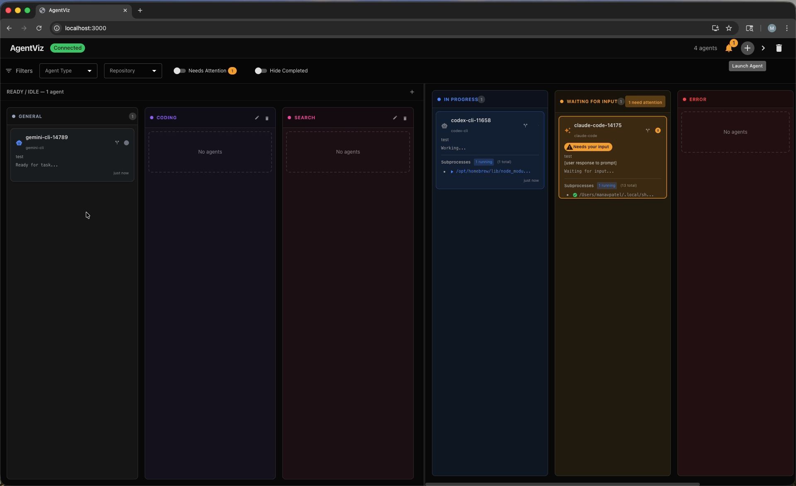
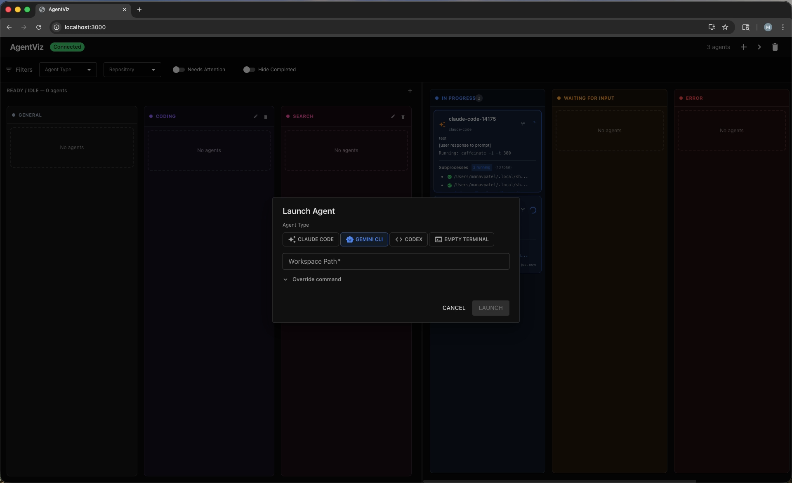
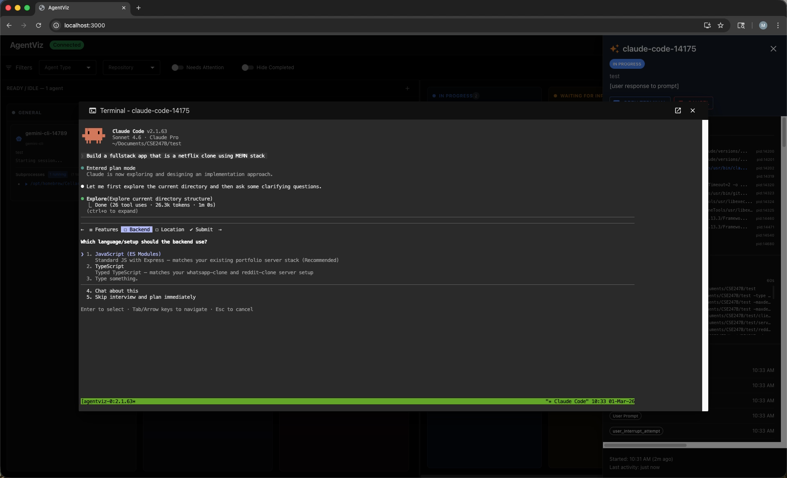

# AgentViz

AgentViz is a local dashboard and event pipeline for visualizing coding agents (Gemini CLI, Claude Code, Codex CLI, and others) while they run in a workspace. It includes a Python backend (FastAPI + Socket.IO), a React frontend dashboard, per-agent adapters, optional `tmux` + `ttyd` web terminals, and remote viewing support over Tailscale/LAN.





## Quick Install (one command)

```bash
curl -LsSf https://raw.githubusercontent.com/mpatel17-ucsc/AgentViz/main/scripts/install.sh | sh
```

Run this from whatever directory you want AgentViz installed in — the repo clones to an `agentviz/` folder there:

```bash
# e.g. from ~/Documents → installs to ~/Documents/agentviz
cd ~/Documents
curl -LsSf https://raw.githubusercontent.com/mpatel17-ucsc/AgentViz/main/scripts/install.sh | sh
```

This single command:
- Installs `uv` if not already present
- Clones the repo to `agentviz/` in your current directory
- Creates a project-local Python venv and installs all dependencies
- Installs `npm` frontend dependencies if `node` is on PATH
- Writes an `agentviz` wrapper to `~/.local/bin/` — no manual venv activation ever needed
- Asks if you want `~/.local/bin` added to `PATH` in your shell rc automatically

To install to a specific path instead:

```bash
curl -LsSf https://raw.githubusercontent.com/mpatel17-ucsc/AgentViz/main/scripts/install.sh | sh -s -- ~/my-agentviz
```

If the installer didn't update your shell rc, add this manually:

```bash
export PATH="$HOME/.local/bin:$PATH"   # add to ~/.zshrc or ~/.bashrc
```


> **Note:** `tmux` and `ttyd` are system tools the installer does not manage — install them separately (`brew install tmux ttyd` on macOS) if you plan to use `--tmux-start`.

## Features

- Live agent state tracking (`ready`, `in_progress`, `waiting_for_input`, `completed`, `error`)
- Hooks-based integration for Gemini CLI and Claude Code
- Codex CLI notify-hook integration (via temporary `CODEX_HOME`)
- File activity / subprocess monitoring
- `tmux` + `ttyd` web terminal access for each agent session
- Remote dashboard + web terminal access (Tailscale/LAN)

## Manual Setup (alternative to Quick Install)

> **Note:** If you used the quick installer above, skip this section — the `agentviz` wrapper script activates its own environment automatically.

### System tools

- `python` 3.10+
- `node` + `npm` (for the frontend)
- `tmux` (required for `--tmux-start`)
- `ttyd` (required for `--tmux-start`)
- `git`

macOS (Homebrew) example:

```bash
brew install tmux ttyd
```

### Coding agent CLIs (install + authenticate separately)

Install the agent CLI(s) you want to monitor and make sure they run from your shell (or use an absolute path in the command).

- Gemini CLI (`gemini` or your local binary path)
- Claude Code (`claude`)
- Codex CLI (`codex`)

AgentViz does not install these CLIs for you.

### Python Setup

**Preferred — using `uv` (fastest, reproducible):**

```bash
uv sync                    # creates .venv, installs all deps
uv pip install -e .        # install agentviz CLI in editable mode
source .venv/bin/activate  # activate venv so `agentviz` is on PATH
```

**Alternative — using pip:**

```bash
python3 -m venv venv
source venv/bin/activate
pip install --upgrade pip
pip install -r requirements.txt
pip install -e .
```

### Frontend Setup

```bash
npm install --prefix frontend
```

Verify everything works:

```bash
agentviz --help
```

## Agent CLI Setup (Gemini / Claude / Codex)

### Prerequisites per CLI

- Install the CLI
- Authenticate (vendor login/auth flow)
- Ensure the executable is on `PATH` or use an absolute path

Examples:

- `gemini` or `/opt/homebrew/bin/gemini`
- `claude`
- `codex`

## CLI Commands and Flags

### `agentviz server`

Starts the backend server (Socket.IO + API) on port `8787`.

```bash
agentviz server [--bind <ip>] [--remote]
```

All flags are optional — running `agentviz server` with no flags works for local-only use.

| Flag | Required | Description |
|------|----------|-------------|
| `--remote` | No | Binds to `0.0.0.0` so other devices (phone, tablet) can reach the backend. Use this for Tailscale/LAN access. |
| `--bind <ip>` | No | Bind to a specific IP instead. Default is `127.0.0.1` (localhost only). |

Backend is always on port `8787`.

### `agentviz run`

Runs and monitors one coding agent process.

```bash
agentviz run -w <workspace> <agent-type> <agent-command> [agent-args...]
```

| Flag / Argument | Required | Description |
|-----------------|----------|-------------|
| `-w <workspace>` | **Yes** | Directory the agent will work inside |
| `<agent-type>` | **Yes** | See table below |
| `<agent-command>` | **Yes** | See table below |
| `--tmux-start` | No | Run agent in a `tmux` session and expose a `ttyd` web terminal |
| `--remote <ip-or-hostname>` | No | Required if using `--tmux-start` for phone access — sets the host embedded in the `ttyd` terminal URL |
| `-i, --id <agent-id>` | No | Custom ID for this agent in the dashboard (default: `<agent-type>-<pid>`) |

**`<agent-type>` and `<agent-command>` by agent:**

| Agent | `<agent-type>` | `<agent-command>` |
|-------|---------------|-------------------|
| Gemini CLI | `gemini-cli` | `/opt/homebrew/bin/gemini` |
| Claude Code | `claude-code` | `claude` |
| Codex CLI | `codex-cli` | `codex` |
| Synthetic (test) | `synthetic` | any dummy command (e.g. `echo`) |

> **`--remote` on `server` vs `run` are different:**
> - `agentviz server --remote` — exposes the **backend** to other devices
> - `agentviz run --remote <ip>` — exposes each agent's **ttyd web terminal** to other devices

## Running AgentViz

Open **3 terminal tabs** and run one command in each.

**Tab 1 — Backend**
```bash
agentviz server --remote
```

**Tab 2 — Frontend**
```bash
cd agentviz/frontend   # relative to wherever you ran curl
HOST=0.0.0.0 npm start
```
> `HOST=0.0.0.0` makes the dashboard reachable from your phone over Tailscale/LAN.

**Tab 3 — Agent**

Pick the command for the agent you want to run. Replace `<WORKSPACE>` with the directory the agent should work in, and `<TAILSCALE_IP>` with your Tailscale IP or hostname.

```bash
# Gemini CLI
agentviz run -w <WORKSPACE> --tmux-start --remote <TAILSCALE_IP> gemini-cli /opt/homebrew/bin/gemini

# Claude Code
agentviz run -w <WORKSPACE> --tmux-start --remote <TAILSCALE_IP> claude-code claude

# Codex CLI
agentviz run -w <WORKSPACE> --tmux-start --remote <TAILSCALE_IP> codex-cli codex
```

> If the agent binary is on your `PATH` you can use its name directly (e.g. `gemini`). Otherwise pass the full path.

## Tailscale Setup (Phone Access)

This is the standard way to access AgentViz from your phone.

### On your laptop (running AgentViz)

1. Install and sign in to Tailscale.
2. Ensure Tailscale is connected.
3. Get your Tailscale IPv4 address (example command):

```bash
tailscale ip -4
```

Use that IP (or your Tailscale hostname) as `<TAILSCALE_IP_OR_HOSTNAME>`.

### On your phone

1. Install Tailscale and sign into the same tailnet.
2. Confirm the phone is connected to Tailscale.
3. Open the frontend in Safari/Chrome:

```text
http://<TAILSCALE_IP_OR_HOSTNAME>:3000
```

Example:

```text
http://100.x.x.x:3000
```

Notes:

- `:3000` is the React frontend dev server
- The frontend connects to backend port `8787` automatically using the same host shown in the browser URL
- Per-agent `ttyd` terminals use dynamically assigned ports (AgentViz publishes those links in the dashboard)

## Benchmarks

AgentViz was benchmarked against [TmuxCC](https://github.com/nyanko3141592/tmuxcc) and [Agent of Empires](https://github.com/njbrake/agent-of-empires) on approval-detection latency and memory overhead. See [`benchmarks/`](benchmarks/) for the full methodology, results, and reproduction instructions.

## Troubleshooting

- `Error: Could not connect to AgentViz server at http://localhost:8787`
  - Start `agentviz server` first (same machine as `agentviz run`)

- `tmux not found` / `ttyd not found`
  - Install both system tools (`brew install tmux ttyd`)
  - `--tmux-start` requires both

- Phone can open frontend but dashboard shows disconnected
  - Make sure backend was started with `agentviz server --remote`
  - Confirm port `8787` is reachable on your Tailscale IP

- Phone cannot open `http://<ip>:3000`
  - Make sure frontend was started with `HOST=0.0.0.0 npm start --prefix frontend`
  - Confirm laptop and phone are on the same Tailscale tailnet

- Agent settings files are modified unexpectedly
  - AgentViz writes temporary hook config into the workspace (`.gemini/settings.json` or `.claude/settings.local.json`) and restores it on cleanup
  - Codex uses a temporary `CODEX_HOME` and does not modify your global config

## Notes

- `agentviz run` connects to the backend at `http://localhost:8787`, so the backend must run on the same machine as the monitored agent process.
- For remote use, you are remotely viewing the dashboard/ttyd terminals; the actual agent process still runs on the laptop.
