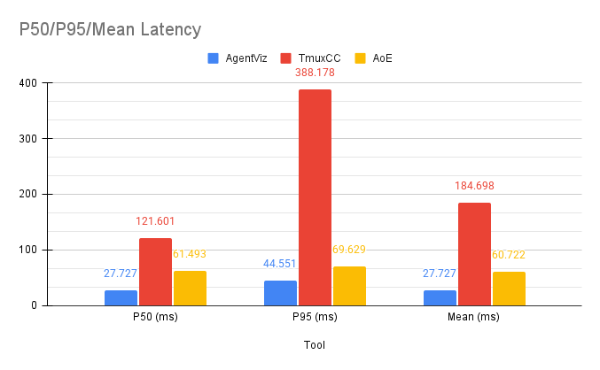
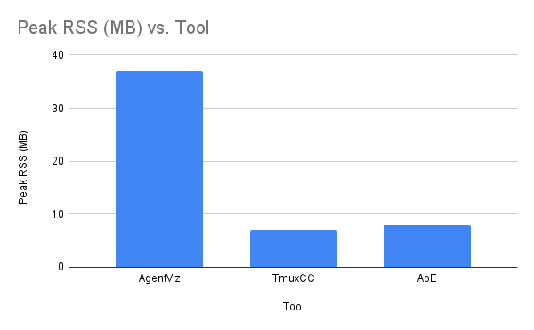

# AgentViz Benchmarks

This directory contains the benchmark harness used to compare AgentViz against [TmuxCC](https://github.com/nyanko3141592/tmuxcc) and [Agent of Empires (AoE)](https://github.com/njbrake/agent-of-empires) on approval-detection latency and memory overhead.

The results from these benchmarks are reported in the AgentViz capstone paper.

## Files

- `benchmark_equal.py` — Main benchmark harness (runs all three tools against the same synthetic task)
- `unified_agent.py` — Synthetic coding-task agent used as the common workload
- `generate_report.py` — Report generation utilities
- `results/` — Saved benchmark output JSON files

## Methodology

A synthetic `unified_agent.py` script replays a fixed sequence of agent states (Processing → AwaitingApproval → Idle → Completed) with realistic timing. Each dashboard monitors the same fake agent via its native mechanism:

- **AgentViz**: push event — time from `AWAITING_APPROVAL` in the agent log to `waiting_for_input` Socket.IO event arrival
- **TmuxCC**: poll at 500 ms — `tmux capture-pane` until `Pending approval` appears in TmuxCC's TUI pane
- **AoE**: poll at 20 ms — `aoe status --json` until `waiting > 0`

Tmux `send-keys` / `capture-pane` round-trip baseline (p50 = 8.2 ms, p95 = 9.8 ms) was measured separately to isolate terminal I/O overhead from dashboard overhead.

**Primary metric**: Approval-detection latency — the time from when `unified_agent.py` logs `AWAITING_APPROVAL` to when each tool surfaces a waiting/approval signal to an external observer.

| Tool | End signal |
|------|-----------|
| AgentViz | `waiting_for_input` Socket.IO event arrival at port 8787 |
| TmuxCC | `Pending approval` string visible in TmuxCC's TUI pane (via `tmux capture-pane`) |
| AoE | `aoe status --json` response where `waiting > 0` |

This is an end-to-end observer-visible latency benchmark. The tools are architecturally different (push vs CLI poll vs TUI render), and that difference is part of what is being measured.

## Results (complex scenario, 5 trials)

### Approval-Detection Latency

| Dashboard | p50 (ms) | p95 (ms) | Mean (ms) | Mechanism |
|-----------|----------|----------|-----------|-----------|
| **AgentViz** | **27.7** | **44.6** | **27.7** | Push (Socket.IO) |
| AoE | 61.5 | 69.6 | 60.7 | Poll 20 ms |
| TmuxCC | 121.6 | 388.2 | 184.7 | Poll 500 ms |

AgentViz detects approval prompts ~2.2× faster than AoE and ~4.4× faster than TmuxCC at the median. All three tools achieved 100% state-coverage accuracy (AwaitingApproval, Processing, Idle, Completed all detected across all trials).

Raw results are in `results/equal_complex_20260223_225312.json`.



### Memory Overhead

| Tool | Peak RSS (MB) | Notes |
|------|--------------|-------|
| **AgentViz server** | 36.9 | Persistent daemon — always resident while monitoring |
| AoE | 7.9 | TUI — binary init + session query cost shown |
| TmuxCC | 7.0 | TUI — binary init cost shown |

AgentViz runs a persistent FastAPI + Socket.IO server (~37 MB), whereas TmuxCC and AoE are TUI binaries that are only active when opened in a terminal. The memory trade-off enables push-based detection and the web dashboard.



## How to Reproduce

**Requirements:**
- Python 3.10+
- An attached tmux session (the harness bootstraps itself into tmux if needed)
- AgentViz backend running (`agentviz server`)

**Run:**

```bash
cd <repo-root>
source .venv/bin/activate

# Start the AgentViz backend in a separate terminal first
agentviz server

# Then run the benchmark (from an attached tmux session)
SYNTH_APPROVAL_HOLD_SEC=5 python3 benchmarks/benchmark_equal.py --scenario complex --trials 5
```

Scenarios: `simple` (no approvals), `medium` (1 approval), `complex` (2 approvals).

Results are written to `benchmarks/results/` as a timestamped JSON file.

## Getting the TmuxCC and AoE Binaries

`benchmark_equal.py` expects `tmuxcc` and `aoe` binaries in a `benchmarks/bin/` directory. Build them from source and place them there:

```bash
# TmuxCC
git clone https://github.com/nyanko3141592/tmuxcc
cd tmuxcc && cargo build --release
cp target/release/tmuxcc /path/to/agentviz/benchmarks/bin/tmuxcc

# Agent of Empires
git clone https://github.com/njbrake/agent-of-empires
cd agent-of-empires && cargo build --release --bin aoe
cp target/release/aoe /path/to/agentviz/benchmarks/bin/aoe
```

Both require [Rust + Cargo](https://rustup.rs/) to build.

## Caveats

- The three tools are observed through different interfaces (Socket.IO event, CLI JSON poll, TUI pane capture). These reflect genuine architectural differences, not measurement bias.
- AgentViz memory is measured as live daemon RSS via `psutil`. TmuxCC and AoE startup cost is measured with `/usr/bin/time -l` against lightweight commands (`--help`, `status`), since they are TUI binaries rather than persistent daemons.
